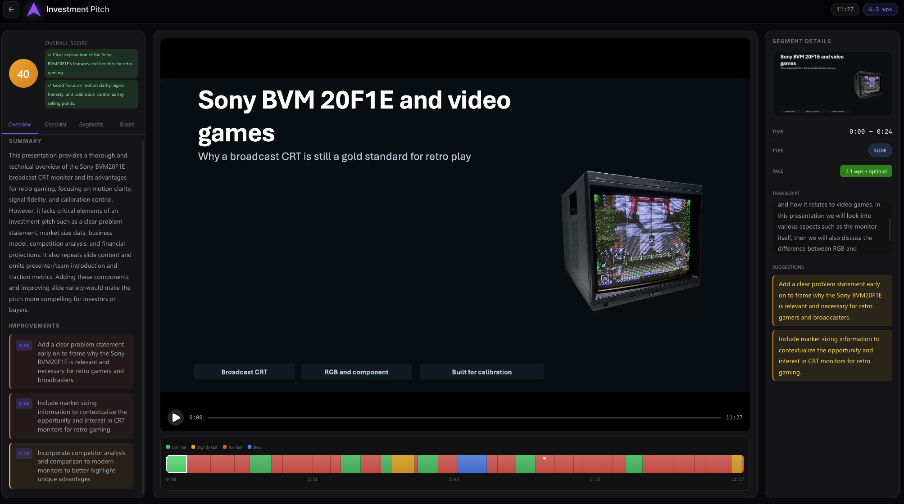
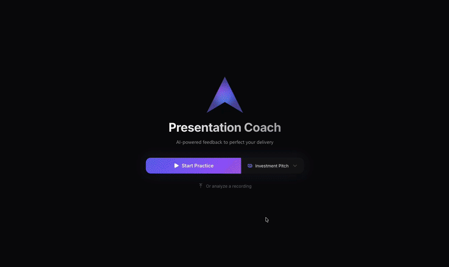

<div align="center">


### Practice your pitch with an AI coach that sees your slides and hears your voice.

[](https://opensource.org/licenses/MIT)
[](https://www.python.org/)
[](https://reactjs.org/)

[How it works](#how-it-works) · [Tech Stack](#tech-stack) · [Getting Started](#getting-started)



</div>

---

## How it works

**Live practice:** Start a session and talk with an AI coach. When you're ready, share your screen and present. The coach listens silently, then you can ask questions or request feedback. Finally, get a detailed analysis of your performance.

**Analyze a recording:** Upload a video of a past presentation and get the same analysis—pacing, slide quality, and actionable suggestions.

### Analysis includes

- **Pacing timeline** — See where you spoke too fast, too slow, or at a good pace
- **Slide-by-slide scores** — Each slide gets a quality rating with specific improvements
- **Checklist evaluation** — Did you cover the key points for your presentation type?
- **Timestamped suggestions** — Click any feedback item to jump to that moment in the video

<div align="center">

</div>

---

## Tech Stack

| Layer | Technologies |
|-------|--------------|
| Backend | Python, Flask, WebSockets |
| Frontend | React, TypeScript, Fluent UI, Vite |
| AI | Microsoft Foundry (GPT-4.1), Azure Voice Live API, Azure Content Understanding |
| Infrastructure | Azure Container Apps, Bicep |

---

## Getting Started

> Requires Python 3.11+, Node.js 20+, FFmpeg, and an Azure subscription with access to Microsoft Foundry, Voice Live API, and Content Understanding.

**Run locally:**

```bash
git clone https://github.com/aymenfurter/presentation-coach.git
cd presentation-coach
cp .env.example .env   # Add your Azure credentials
./scripts/start.sh     # Installs dependencies and starts the app
```

**Deploy to Azure** with the [Azure Developer CLI](https://learn.microsoft.com/en-us/azure/developer/azure-developer-cli/install-azd):

```bash
azd auth login
azd up
```
